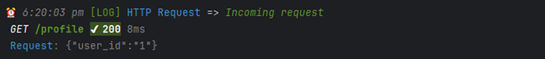
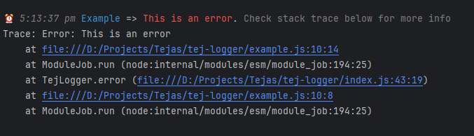

# <p align="center">Tej-Logger</p>

A minimal yet powerful logger for Node.js applications. It supports log, info, error, debug and warn. It also supports ANSI styles and colors. It also has an express middleware to log every incoming request.

# Table of contents
1. [Features](#-features)
2. [How to Install](#-install)
3. [Express Middleware](#-express-middleware)
4. [Basic Usage](#-basic-usage)
   1. [Log](#-log)
   2. [Info](#-info)
   3. [Error](#-error)
   4. [Debug](#-debug)
   5. [Warn](#-warn)

## 🧐 Features <a id="-features" class="anchor" aria-hidden="true" href="#️-features"></a>
- Simple and minimal
- Express middleware to log every incoming request
- Log based on identifiers
- Supports log, info, error, debug and warn
- Supports ANSI styles and colors
-  [UPCOMING] - Configuration for log levels and log file path


## 🛠️ Install <a id="-install" class="anchor" aria-hidden="true" href="#️-install"></a>
```bash
npm install tej-logger
```

<br>

## 🚀 Express Middleware <a id="-express-middleware" class="anchor" aria-hidden="true" href="#️-express-middleware"></a>
```js
import logHttpRequest from "tej-logger/express-middleware";

// Add this middleware to your express app before any other middleware
app.use(logHttpRequest);
```


<br>

## 🧑🏻‍💻 Basic Usage <a id="-basic-usage" class="anchor" aria-hidden="true" href="#️-basic-usage"></a>
```js
import TejLogger from "tej-logger"

const logger = new TejLogger("identifier");
logger.log("Hello World!");
```

### Log <a id="-log" class="anchor" aria-hidden="true" href="#️-log"></a>
```js
logger.log("This is a log message");
```


### Info <a id="-info" class="anchor" aria-hidden="true" href="#️-info"></a>
```js
logger.info("This is an info message");
```


### Error <a id="-error" class="anchor" aria-hidden="true" href="#️-error"></a>
```js
logger.error("This is an error");
//or
logger.error(new Error("This is an error"));
```



### Debug <a id="-debug" class="anchor" aria-hidden="true" href="#️-debug"></a>
```js
logger.debug("This is a debug message");
```


### Warning <a id="-warn" class="anchor" aria-hidden="true" href="#️-warn"></a>
```js
logger.debug("This is a debug message");
```


<br>

## 🍰 Contributing <a name = "contributing"></a>
Contributions are what make the open source community such an amazing place to be learn, inspire, and create. Any contributions you make are **greatly appreciated**.


<br>

## ❤️ Support
A simple star to this project repo is enough to keep me motivated on this project for days. If you find your self very much excited with this project let me know with a star.


<br>

## 🙇 Author
#### Hirak Chhatbar
- Github: [@hirakchhatbar](https://github.com/hirakchhatbar)


<br>

## ➤ License
Distributed under the MIT License. See [LICENSE](LICENSE) for more information.
